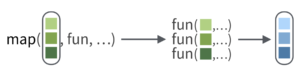
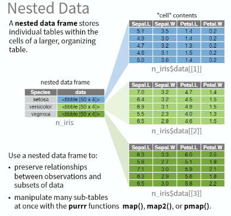

```{r setup, include=FALSE}
knitr::opts_chunk$set(echo = TRUE,
                      warning = FALSE,
                      message = FALSE)
```

It's easiest to install `purrr` as part of the `tidyverse`. `furrr` needs to be installed separately. For info, this is a paralellised version of `purrr`; more on this later. We are also going to use the `repurrrsive` package for data. 

```{r load_packages}
# make sure these are all installed
library(tidyverse)
library(furrr)
library(repurrrsive)
library(magrittr)
library(broom)
library(furrr)
```

# Learning to map

The basic function of `purrr` is `map()`. This is very similar to the `apply()` family of functions. 

A template for basic map() usage:

```
map(YOUR_LIST, YOUR_FUNCTION)
```

It works like this: 



The function can be inbuilt, or user-defined. 

We are going to use the Game of Thrones characters dataset from `repurrrsive`. Quick look at the data. 

```{r got_data}
length(got_chars)
names(got_chars[[1]])
got_chars[[1]]
```

Let's use `map()` for element extraction. We can extract the name of all the characters in the dataset.

```{r map_first_eg}
map(got_chars, "name")
```

As these are all character fields, we can use `map_chr()` to extract them as such. 

```{r map_chr_eg}
map_chr(got_chars, "name")
```
Notice instead of a list output, we get a character vector. 

We can also output a dataframe, let's output several attributes of the characters into a dataframe using `map_dfr()`. We can use the `extract()` function from `magrittr` to extract multiple elements. 

```{r map_dfr_eg}
map_dfr(got_chars, extract, c("name", "culture", "gender", "id", "born", "alive"))
```
Here, we have passed in additional optional arguments. These are all other arguments passed into the function - in this case, the name of the elements to extract. 

## Parallel map

The `map2()` and `pmap()` functions allow us to pass in two or more lists, respectively. I'll give a quick example of `map2()` with a user-defined function. 

First, extract names and birthplace information

```{r set_map2_eg_data}
nms <- got_chars %>% 
  map_chr("name")
birth <- got_chars %>% 
  map_chr("born")
```

Then we can create a user-defined function which takes a name and birthplace as input, and outputs a string stating their name "was born" and birthplace. 

```{r map2_eg}
my_fun <- function(x, y) paste(x, "was born", y)
map2_chr(nms, birth, my_fun) %>% head()
```

# A real example

Although these are helpful to understand the general concepts behind purrr, I never really saw it's power until I started using it for performing the same analysis on multiple datasets. 

Here is `purrr` being used in [my own paper](https://besjournals.onlinelibrary.wiley.com/doi/full/10.1002/pan3.10042). Full analysis details and code are available on [GitHub](https://github.com/laurajanegraham/recreation_scaling). 
In this, I aimed to understand drivers of outdoor recreation based on (1) multiple scales, and (2) multiple datasets. In total, I needed to perform the same analysis at 4 spatial resolutions on 2 datasets (a total of 8 analyses). Rather than write out the analysis 8 times, or do a for loop, what I've done is used `map()` to perform the analysis on all datasets simultaneously. 

First, we need to know about nested datasets using `nest()`


```{r rec_data}
load("data/rec_analysis_data.Rda")

head(df_analysis_n)
```

```{r rec_mod_function}
fit_mod_full <- function(dat) {
  glm(response ~ 
        lcm_agri + 
        lcm_forest + 
        lcm_coast + 
        lcm_shei + 
        dem_range + 
        pa + 
        pop + 
        dist,
      family = poisson,
      data = dat)
}

calc_d2 <- function(x) {
   (x$null.deviance - x$deviance) / x$null.deviance
}
```

```{r rec_mod_fit}
mod <- df_analysis_n %>% 
  group_by(resolution, dataset) %>% 
  nest() %>% 
  mutate(mod_full = map(data, fit_mod_full),
         mod_tidy = map(mod_full, tidy),
         mod_full_D2 = map_dbl(mod_full, calc_d2)
         )
```

```{r rec_mod_stats}
mod_stats <- mod %>%
  select(resolution, dataset, mod_tidy) %>% 
  unnest() %>% 
  filter(term != "(Intercept)") %>% 
  mutate(lci = estimate - 1.96*std.error,
         uci = estimate + 1.96*std.error) %>% 
  select(resolution, dataset, var = term, coef = estimate, lci, uci) 

ggplot(mod_stats, aes(x = resolution, y = coef, ymin = lci, ymax = uci, colour = dataset)) + 
  geom_point(position = position_dodge(0.8)) + 
  geom_errorbar(position = position_dodge(0.8), width = 0.5) + 
  geom_hline(yintercept = 0, linetype = "dashed") + 
  scale_colour_manual("Proxy", values = c("#4daf4a", "#984ea3")) +
  xlab("Analysis Resolution") + ylab(expression("Coefficient Estimate " %+-% " 95% CI")) + 
  facet_wrap(~var, nrow = 2)
```
```{r}
mod_d2 <- mod %>% 
  select(resolution, dataset, mod_full_D2)

knitr::kable(mod_d2, digits = 2)
```

# `furrr`

`furrr` allows us to run `purrr` functions in parallel - great for functions which take a while. 

This is built upon the [`future` package](https://cran.r-project.org/web/packages/future/vignettes/future-1-overview.html).

First we have to set up a parallel session. In windows, this needs to be `plan(multisession)`. For mac or linux, `plan(multicore)` is more efficient. 

```{r furrr_setup}
plan(multisession)
```

```{r furrr_eg}
mod_furrr <- df_analysis_n %>% 
  group_by(resolution, dataset) %>% 
  nest() %>% 
  mutate(mod_full = future_map(data, fit_mod_full),
         mod_tidy = map(mod_full, tidy))
```

In this case, the overhead of setting up the paralell session makes this not worth it, but for more models to be fit, or for models or functions that take longer, it's well worth it. 

The `furrr` functions follow the same format as the `purrr` functions (e.g. `future_map_dfr`, `future_map_dbl`, `future_map_chr`, `future_map2` etc.). 

# Further resources

- [`purrr` tutorial](https://jennybc.github.io/purrr-tutorial/)
- [`purrr` cheatsheet](https://github.com/rstudio/cheatsheets/blob/master/purrr.pdf)
- [`furrr` tutorial](http://zevross.com/blog/2019/02/12/dramatically-speed-up-your-r-purrr-functions-with-the-furrr-package/)
